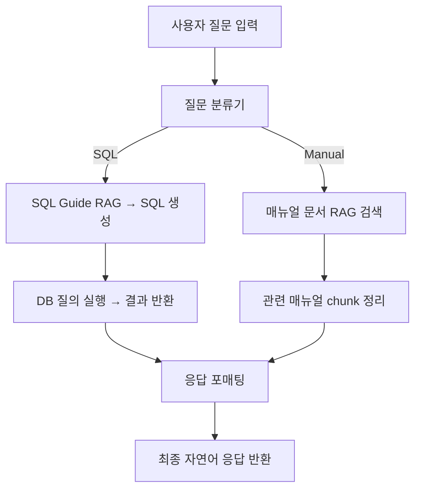

# 🧠 RAG 기반 자연어 → SQL + 매뉴얼 대응 시스템 백엔드 요구서 (Canvas)

## 1. 📁 디렉토리 구조 (현행 유지)

```
project_root/
├── data/{factory, manual, sqlguide}
├── rag_engine/
│   ├── chain/{classifier, execution, routing}
│   ├── retriever/
│   ├── responder/
├── config/
├── frontend/
└── main.py
```

---

## 2. 📌 각 파일/모듈 구현 명세

### 🗂 chain/classifier/classifier.py

* 사용자 질문을 "sql" vs "manual"로 분류
* 키워드 기반 또는 간단한 분류 모델 활용 가능

### 🗂 chain/execution/sql\_executor.py

* RAG 기반으로 SQL 예제 검색
* OpenAI Prompt를 통해 SQL 생성
* DB 실행 및 결과 반환

### 🗂 chain/execution/manual\_executor.py

* 고장 키워드 기반 벡터 검색 (manual\_retriever)
* 유사한 매뉴얼 chunk 반환
* GPT 응답으로 최종 포맷팅

### 🗂 chain/routing/chat\_router.py

* 질문 분류 → 각 실행기 호출
* 최종 응답 JSON으로 포장

### 🗂 retriever/sql\_retriever.py, manual\_retriever.py

* FAISS 기반 청크 검색기
* 입력 임베딩 → 상위 k개 chunk 반환

### 🗂 responder/formatter.py

* SQL 결과, 매뉴얼 조합 응답을 자연어 포맷으로 생성

### 🗂 main.py

* FastAPI 앱 생성
* `/chat` POST API 엔드포인트
* 입력 질문 + 선택 옵션 → 최종 응답 반환

---

## 3. 🧪 필요 Python 라이브러리

```
fastapi
uvicorn
openai
faiss-cpu
sentence-transformers
sqlite3
pydantic
python-dotenv
```

---

## 4. 🔄 데이터 흐름도



---

## ✅ 기타 참고 사항

* 모든 `.py` 파일은 최소 단위 테스트 가능하도록 설계
* OpenAI API Key는 `.env`로 관리
* 디렉토리 구조 및 RAG 흐름은 기능 단위로 모듈화되어 있음

---

## 💬 예시 챗봇 인터페이스 시나리오

```
┌─────────────────────────────────────────────┐
│ 공장 로그 분석 챗봇 🔍                           │
├─────────────────────────────────────────────┤
│ 사용자 질문: [   오전 9시에 무슨 일이 있었어?   ] │
├─────────────────────────────────────────────┤
│ 📚 관련 로그 블록:                             │
│ [09:00~09:10] 작동 → 오류 → 정지            │
│ [09:10~09:20] 오류 → 정지                     │
├─────────────────────────────────────────────┤
│ 🤖 GPT 응답:                                  │
│ 9시대에는 총 5번의 오류가 발생했고, 그 중 2회는 │
│ 바로 정지로 이어졌습니다.                     │
└─────────────────────────────────────────────┘
```

* 위와 같은 UI는 `/chat` API의 응답을 기준으로 프론트에서 구성 가능
* GPT 응답은 SQL 결과 + 매뉴얼 RAG 내용을 합성하여 생성됨

---

## 🛠️ 전체 백엔드 구현 순서

### ✅ 1단계: 데이터 전처리 및 저장

| 순서  | 작업                                 | 파일                       | 목적                    |
| --- | ---------------------------------- | ------------------------ | --------------------- |
| 1.1 | `machine_data.txt` → DB 변환         | `processor/db_loader.py` | DuckDB 또는 SQLite로 정형화 |
| 1.2 | `sql_guide.txt`, 매뉴얼 문서 → chunk 처리 | `processor/chunker.py`   | RAG 벡터 인덱스를 위한 청크화    |
| 1.3 | 청크 임베딩 저장 (FAISS)                  | `vector_store/`          | 벡터 검색을 위한 인덱스 구축      |

### ✅ 2단계: RAG 검색기 구축

| 순서  | 작업          | 파일                              | 설명                        |
| --- | ----------- | ------------------------------- | ------------------------- |
| 2.1 | SQL 가이드 검색기 | `retriever/sql_retriever.py`    | 질문 임베딩 → 가장 유사한 SQL 예시 반환 |
| 2.2 | 매뉴얼 문서 검색기  | `retriever/manual_retriever.py` | 고장 대응 문서 chunk 반환         |

### ✅ 3단계: LangChain 질문 분류기 구현

| 순서  | 작업                      | 파일                               | 설명                         |
| --- | ----------------------- | -------------------------------- | -------------------------- |
| 3.1 | LangChain 기반 LLM 분류기    | `chain/classifier/classifier.py` | RouterChain 또는 LLMChain 기반 |
| 3.2 | 테스트: 질문 → sql/manual 분류 | CLI or 유닛 테스트                    | 예시 질문으로 확인                 |

### ✅ 4단계: 실행기 구현

| 순서  | 작업          | 파일                                   | 설명                     |
| --- | ----------- | ------------------------------------ | ---------------------- |
| 4.1 | SQL 생성 및 실행 | `chain/execution/sql_executor.py`    | RAG로 SQL 생성 → DB 질의 실행 |
| 4.2 | 매뉴얼 응답 생성기  | `chain/execution/manual_executor.py` | 관련 chunk → 응답 구성       |

### ✅ 5단계: 분기 라우터 구현

| 순서  | 작업               | 파일                             | 설명                |
| --- | ---------------- | ------------------------------ | ----------------- |
| 5.1 | 질문 → 분류 → 실행기 호출 | `chain/routing/chat_router.py` | 입력 질문을 기준으로 흐름 분기 |
| 5.2 | 응답 JSON 생성       | `responder/formatter.py`       | 최종 응답 자연어 포맷팅     |

### ✅ 6단계: API 서버 구축

| 순서  | 작업           | 파일                 | 설명                  |
| --- | ------------ | ------------------ | ------------------- |
| 6.1 | FastAPI 앱 구성 | `main.py`          | `/chat` POST API 작성 |
| 6.2 | API 테스트      | Postman or Swagger | 응답 구조 확인            |

### ✅ 7단계: 프론트 연동 및 시각화

| 순서  | 작업       | 파일                            | 설명                |
| --- | -------- | ----------------------------- | ----------------- |
| 7.1 | 프론트엔드 구성 | `frontend/chatbot/index.html` | 질문 입력, 응답 출력 창 구성 |
| 7.2 | API 연동   | JS → `/chat` 호출               | 결과 실시간 표시         |

---

## ✅ 개발 진행사항 체크리스트
* [x] 데이터 전처리 모듈 작성 (`db_loader.py`, `chunker.py`)
* [x] FAISS 기반 벡터 인덱스 구축 완료
* [ ] SQL/매뉴얼 retriever 모듈 구현 완료
* [ ] LangChain 질문 분류기 (`classifier.py`) 구현
* [ ] SQL 실행기 (`sql_executor.py`) 및 DB 연결
* [ ] 매뉴얼 응답기 (`manual_executor.py`) 응답 구성
* [ ] ChatRouter 구성 및 end-to-end 흐름 확인
* [ ] `/chat` API FastAPI 서버 완성
* [ ] 프론트엔드 입력/출력 UI 구성 완료
* [ ] API 연동 및 전체 통합 테스트

