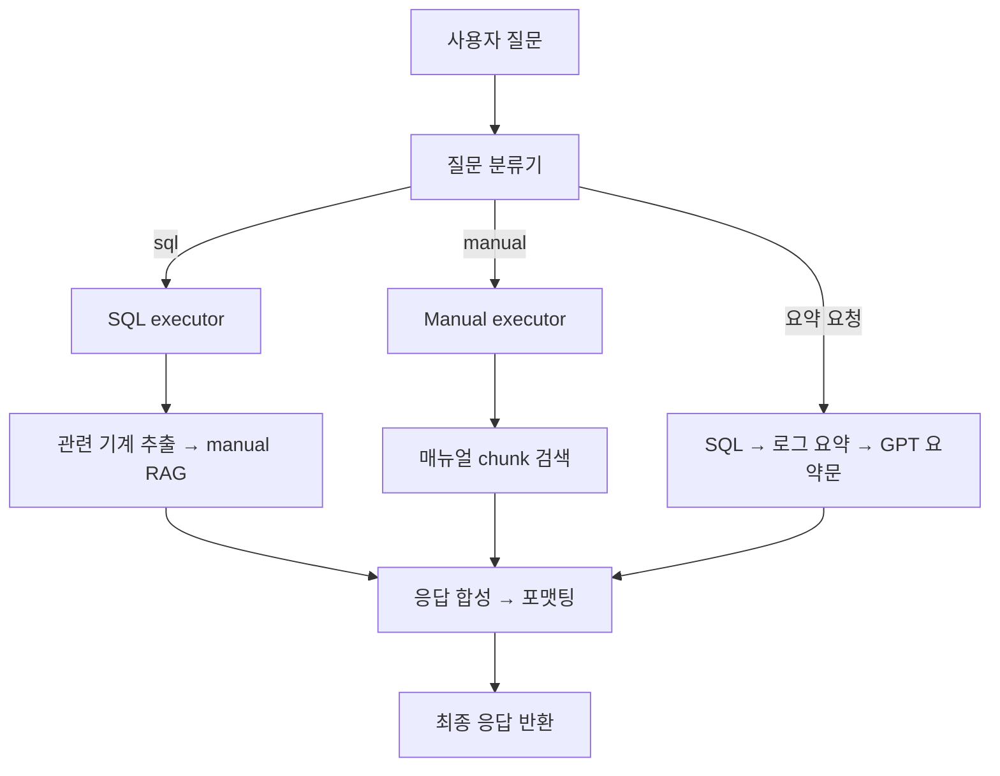

```mermaid
flowchart TD
    A[사용자 질문] --> B[질문 분류기]
    B -->|sql| C[SQL executor]
    B -->|manual| D[Manual executor]
    B -->|요약 요청| E[SQL → 로그 요약 → GPT 요약문]
    C --> F[관련 기계 추출 → manual RAG]
    D --> G[매뉴얼 chunk 검색]
    F & G --> H[응답 합성 → 포맷팅]
    E --> H
    H --> I[최종 응답 반환]
```
